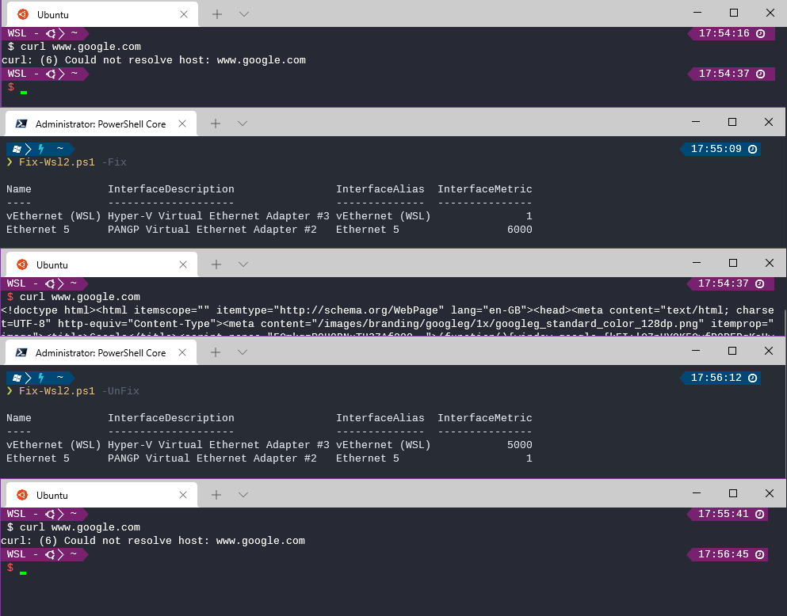

# FixWsl2
Workaround for WSL2 being cut off from network when connected to a VPN. WSL2 is a seperate VM with its own network adapter so connecting to a VPN in the host breaks internet connectivity. Sigh.

This PowerShell script changes the priority of the adapters so the WSL2 NIC gets out first



# Running

`./Fix-Wsl2.ps1` *parameters*


|Parameter|Description|
|--|--|
|`-Fix`|fix WSL2 and break other stuff, maybe|
|`-UnFix`|set things back|
|`-VpnAdapter` *Name*|Match your VPN adapter. The default is for GlobalProtect|
|`-Whatif`|Get a dump of the current adapters and what would be done with the above options|


# Installation
This script requires the [Join-Object](http://ramblingcookiemonster.github.io/Join-Object/) PowerShell Module, install that with

```
Install-Module -Name Join-Object
```


# Examples

## Help
```
❯ Fix-Wsl2.ps1 -Help
WSL2 is a seperate VM with its own network adapter so connecting to a VPN breaks internet connectivity
This script changes the priority of the adapters so the WSL2 NIC gets out first

Parameters:
  -Fix              fix WSL2 and break other stuff
  -UnFix            set things back
  -VpnAdapter Name  match your VPN adapter. The default is for GlobalProtect
  -Whatif           get a dump of the current adapters and what would be done with the above options

Requires Join-Object Module, install with:
   Install-Module -Name Join-Object


Current Interface Metrics:

Name            InterfaceDescription                InterfaceAlias  InterfaceMetric
----            --------------------                --------------  ---------------
vEthernet (WSL) Hyper-V Virtual Ethernet Adapter #3 vEthernet (WSL)            5000
Ethernet 5      PANGP Virtual Ethernet Adapter #2   Ethernet 5                    1
```

## What If
```
Will change Interface Metrics as follows:
    vEthernet (WSL) = 1
    PANGP Virtual Ethernet Adapter #2  = 6000

On:

Name            InterfaceDescription                InterfaceAlias  InterfaceMetric
----            --------------------                --------------  ---------------
vEthernet (WSL) Hyper-V Virtual Ethernet Adapter #3 vEthernet (WSL)               1
Ethernet 5      PANGP Virtual Ethernet Adapter #2   Ethernet 5                 6000
```

## Fix
```
❯ Fix-Wsl2.ps1 -Fix

Name            InterfaceDescription                InterfaceAlias  InterfaceMetric
----            --------------------                --------------  ---------------
vEthernet (WSL) Hyper-V Virtual Ethernet Adapter #3 vEthernet (WSL)               1
Ethernet 5      PANGP Virtual Ethernet Adapter #2   Ethernet 5                 6000
```

## Unfix
```
❯ Fix-Wsl2.ps1 -UnFix

Name            InterfaceDescription                InterfaceAlias  InterfaceMetric
----            --------------------                --------------  ---------------
vEthernet (WSL) Hyper-V Virtual Ethernet Adapter #3 vEthernet (WSL)            5000
Ethernet 5      PANGP Virtual Ethernet Adapter #2   Ethernet 5                    1
```